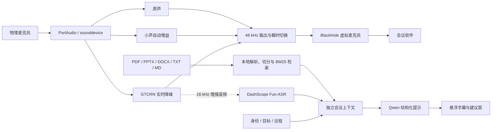

# MeetingEverywhere · AudioRescue

> 复杂环境中，先让对方听清你的声音，再让会议助手跟上上下文。

[](https://github.com/HANA225-HUB/audiorescue-hackathon/actions/workflows/c-contract-tests.yml)
[](https://www.python.org/)
[](LICENSE)
[](#已知限制)

MeetingEverywhere 是一个黑客松期间完成的本地优先会议原型。它把**实时麦克风降噪 / 小声增强**与**基于会前资料和会议上下文的发言提示**放在同一条链路中，同时保留 AudioRescue 的离线音频对比能力。

项目已经结束比赛开发，以开源归档形式继续公开。它适合学习、复现和二次开发，但不是生产级会议、医疗或安全系统。

## 能做什么

| 模块 | 能力 | 当前实现 |
|---|---|---|
| 实时声音恢复 | 让会议软件接收到降噪后或增强后的麦克风声音 | `sounddevice` 采集，sherpa-onnx 在线 GTCRN 推理，自动增益 / 峰值保护，48 kHz 输出至 BlackHole |
| 安静环境小声增强 | 在不经过降噪模型的情况下提高轻声可懂度 | 保留原始人声，使用语音感知自动增益、短时保持和限幅 |
| 会议上下文助手 | 根据当前发言、议程和资料提示下一段内容，或辅助回答问题 | DashScope Fun-ASR 实时转写，本地资料解析与 BM25 检索，Qwen 结构化生成，独立悬浮窗显示 |
| 离线音频急救 | 对文件做标准化、增强、双路转写和可视化对比 | DeepFilterNet3、Whisper、CER、波形 / 声谱图 / 文本差异、结果缓存与导出 |

实时链路提供三种模式：

| 模式 | 适用场景 | 处理方式 |
|---|---|---|
| `enhanced` | 风扇、道路声等稳定噪声环境 | GTCRN 降噪后进行电平整理与峰值保护 |
| `quiet` | 环境安静，但必须小声说话 | 跳过 GTCRN，直接对原始人声做保真自动增益 |
| `raw` | 调试和 A/B 对比 | 原声对齐输出 |

## 系统结构



音频回调只做有界、非阻塞的队列操作；GTCRN 推理、实时 ASR 和模型建议分别在工作线程中运行，网络请求不会阻塞本地声音输出。

## 五分钟体验

### 1. 安装

推荐 Python 3.11。完整依赖包含音频、UI、DeepFilterNet 和 Whisper，首次安装与模型下载需要网络。

```bash
git clone https://github.com/HANA225-HUB/audiorescue-hackathon.git
cd audiorescue-hackathon

conda create -n meetingeverywhere python=3.11 -y
conda activate meetingeverywhere

python -m pip install --upgrade pip
python -m pip install torch torchaudio
python -m pip install -r requirements.txt
```

macOS 真实音频链路还需要 FFmpeg、PortAudio 和一个虚拟音频设备：

```bash
brew install ffmpeg portaudio
brew install --cask blackhole-2ch
```

安装 BlackHole 后请重启 macOS。BlackHole 不随本仓库分发，并受其自身许可证约束。

### 2. 先启动公开 fixture

fixture 只用于确认页面、状态流和交互，不代表真实降噪、转写或模型效果。

```bash
AUDIORESCUE_UI_FIXTURE=1 python app.py
```

终端会显示本地访问地址，通常为 `http://127.0.0.1:7860`。

### 3. 启动真实会议链路

先查看设备编号：

```bash
python scripts/live_gtcrn.py --list-devices
```

再启动网页：

```bash
AUDIORESCUE_UI_FIXTURE=0 python app.py
```

页面中：

1. 输入设备选择实际麦克风；
2. 输出设备选择 `BlackHole 2ch`；
3. 嘈杂环境选择 `enhanced`，安静的小声场景选择 `quiet`；
4. 会议软件的“麦克风”选择 `BlackHole 2ch`；
5. 会议软件的“扬声器”仍选择真实耳机，避免回声和啸叫。

也可以只运行命令行实时降噪：

```bash
python scripts/live_gtcrn.py --virtual-mic --mode enhanced
```

运行中按 `E`、`V`、`R` 可切换降噪增强、小声增强和原声，按 `Q` 退出。

## 启用会议助手

实时转写和模型建议使用阿里云 DashScope。请在服务商控制台创建 Key，并只通过环境变量加载：

```bash
export DASHSCOPE_API_KEY="替换为你自己的 Key"
AUDIORESCUE_UI_FIXTURE=0 python app.py
```

会前可以配置：

- 会议名称、答辩 / 组会 / 汇报等场景；
- 自己的身份、听众、会议目标和议程；
- 重点、约束、表达风格和提示频率；
- PDF、PPTX、DOCX、TXT 或 Markdown 参考资料。

每次“开始新会议”都会创建独立上下文。系统会在本地解析、切分并检索资料，再把**会议预设、最近转写、当前问题以及命中的资料文字片段**发送给模型；原始资料文件不会直接上传。

支持文字型 PDF 和 Office 文档。扫描 PDF、PPT 图片及图表当前不会自动 OCR。

### 数据流与隐私

| 数据 | 去向 |
|---|---|
| 麦克风音频 | 本机完成 GTCRN / 小声增强；启用会议助手后，增强后的 16 kHz 音频会发送给 DashScope Fun-ASR |
| 会前资料 | 原文件在本地解析；与当前问题相关的文字片段会发送给 Qwen |
| API Key | 从环境变量读取，不应写入代码、配置、截图或 Issue |
| 用户录音和运行产物 | 默认由 `.gitignore` 排除，不应提交到公共仓库 |

不要把机密会议资料、个人隐私或未获授权的录音发送给不符合你所在组织政策的云服务。

## 离线音频急救

`core/pipeline.py` 保留了文件处理主链：

```text
音频校验
  → 48 kHz / mono / PCM16 标准化
  → DeepFilterNet3 增强
  → 原声、混合增强、完整增强三轨
  → 使用同一 Whisper 配置做前后转写
  → CER、响度、波形、声谱图和文本差异
```

完整离线准备与演示步骤见 [`docs/OFFLINE_DEMO_RUNBOOK.md`](docs/OFFLINE_DEMO_RUNBOOK.md)。

## Demo 资料

[`demo_assets/transformer_defense_demo/`](demo_assets/transformer_defense_demo/) 提供一套不含私人素材的 Transformer 小型答辩演示包，包括：

- 会前预设；
- 可上传的三份知识资料；
- 完整口播稿；
- 逐镜头录制方案与故障预案。

仓库不包含团队真人录音、原始 Demo 视频或嵌入个人音频的 PPT。

## 测试

```bash
python -m py_compile app.py core/*.py ui/*.py scripts/*.py
python -m unittest discover -s tests -p "test_*.py" -q
git diff --check
```

比赛封存版本在 Python 3.11 环境中通过 **373 项自动测试**。CI 会在 Python 3.10 / 3.11 上执行契约、数据安全和离线 UI 测试。

## 已知限制

- 实时声音恢复目前只在 Apple Silicon macOS 上完成实际设备验证；
- 不同会议软件对虚拟麦克风、自带自动增益和降噪的处理不同，需要逐个验证；
- 戴耳机时，系统尚不能稳定自动听见远端参会者；当前可在悬浮窗手工输入对方问题；
- 尚未实现多说话人分离、声纹识别或稳定的系统音频回环；
- 实时转写和会议建议依赖网络与 DashScope 服务；
- fixture 只证明 UI 和契约链路，不能作为音频效果证据；
- 这是研究与比赛原型，不保证适合所有声学环境或业务合规要求。

## 项目结构

```text
app.py                    Gradio 产品入口
core/live_denoise.py      GTCRN、小声增强、实时队列与声卡引擎
core/realtime_asr.py      DashScope Fun-ASR 协议
core/meeting_context.py   会前资料、BM25、议程状态与会话上下文
core/meeting_assistant.py Qwen 建议与异步编排
core/pipeline.py          离线音频急救主链
ui/                       网页、悬浮窗和控制器
scripts/live_gtcrn.py     实时音频命令行入口
tests/                    合成 fixture 与自动测试
```

比赛归档状态、公开范围和复现边界见 [`ARCHIVE.md`](ARCHIVE.md)。AI 协作使用说明见 [`AI_USAGE.md`](AI_USAGE.md)。

## 开源与第三方组件

本仓库自有代码和文档采用 [MIT License](LICENSE) 开源。运行时模型、外部驱动、云服务以及第三方依赖仍遵循各自许可证和服务条款，详见 [`THIRD_PARTY_NOTICES.md`](THIRD_PARTY_NOTICES.md)。

如果提交 Issue，请不要附带 API Key、私人音频、会议正文、模型缓存路径或其他敏感数据。
