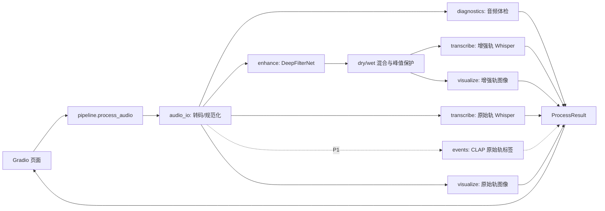

# “听清又听懂·智能音频急救台”团队总技术手册

> 文档用途：未来两天唯一的团队级执行基线。任何新增功能、接口修改和演示承诺，都先与本文对齐。
> 比赛范围：只服务当前 Vibe Coding 黑客松，不承担其他比赛的复用目标。
> 项目周期：2026-07-14 晚至 2026-07-16 17:00 提交。
> 角色代号：A＝音频算法，B＝前端与可视化，C＝系统集成、产品与汇报。
> 版本：v1.0，2026-07-14。

---

## 0. 作战首页

### 0.1 一句话产品

用户上传或录制一段嘈杂语音，系统在本地完成音频体检、人声增强、增强前后转写和多证据对比，让用户同时“听到改善、看到变化、读到结果”。

### 0.2 唯一主演示链路

```text
选择固定样例或上传 10–15 秒音频
→ 音频规范化与体检
→ DeepFilterNet 增强
→ 原始轨和增强轨分别 Whisper 转写
→ A/B 播放 + 波形/声谱图 + 文本差异 + 处理耗时
```

P1 只有在上述链路完全稳定后，才允许增加“CLAP 从原始轨识别环境事件”。

### 0.3 四个不可动摇的决策

1. **P0 先于一切。** CLAP、流式、自然语言控制、多模型比较都不得阻塞 P0。
2. **不冒充实时。** 当前叫“录制后准实时处理”；只有流式链路和端到端延迟实测通过后才称“实时”。
3. **不伪造指标。** 没有人工参考台词就不显示 CER；没有干净参考音频就不显示 PESQ/STOI。
4. **演示不依赖网络。** 权重、固定样例、页面资源和备用录屏都在本地。

### 0.4 P0 完成定义（Definition of Done）

以下条件必须全部满足，才可宣布 P0 完成：

- 一条启动命令能打开页面；
- WAV 和 MP3 至少各成功处理一次；
- 上传/固定样例能产出可播放的增强 WAV；
- 页面同时显示原始轨与增强轨的转写；
- 页面显示两轨波形、声谱图或前后对照图；
- 页面显示总耗时，并在失败时给出人能看懂的警告；
- 模型失败不会让页面永久转圈或直接退出；
- 三个固定样例中至少两个完整通过；
- 主演示样例 10–15 秒，总处理时间目标不超过 20 秒，硬上限 30 秒；
- 断网重启后仍能处理固定样例；
- 三人完整演练一次，5 分钟内讲完并能在 20 秒内切到备用录屏。

### 0.5 截止点

| 截止时间 | 必须得到的结果 | 决策 |
|---|---|---|
| 7 月 14 日 22:30 | DeepFilterNet 与 Whisper 各自独立跑通 | 未跑通的模块立即启用最小回退，不换多套模型 |
| 7 月 15 日 00:00 | 上传→增强→A/B 首次闭环 | 建立可回滚版本 |
| 7 月 15 日 11:30 | P0 完成，至少两个固定样例可用 | 全员第一次正式演示 |
| 7 月 15 日 18:00 | CLAP Go/No-Go | 不稳定则整项删除 |
| 7 月 15 日 22:00 | 功能与样例锁定 | 之后只修问题、不扩功能 |
| 7 月 16 日 10:00 | 停止新增功能 | 进入回归、打包与演练 |
| 7 月 16 日 14:00 | 代码和内容冻结 | 之后只修阻断性缺陷 |
| 7 月 16 日 16:30 | 完成最终提交校验 | 给上传失败留出 30 分钟余量 |

---

## 1. 产品边界

### 1.1 目标用户与场景

优先讲一个主场景，其他场景只用于说明扩展价值：

- 主场景：学生在风扇、空调或咖啡馆噪声中录下课堂/讨论，回听和整理困难；
- 次场景：采访、会议、播客、远程沟通中的脏录音；
- 演示素材：团队自录、明确授权或开放许可音频，避免版权争议。

### 1.2 用户真正得到什么

| 证据层 | 页面产物 | 能回答的问题 |
|---|---|---|
| 听感 | 原始/增强 A/B 播放 | 人耳是否更容易听清？ |
| 视觉 | 波形、声谱图、基础体检 | 系统对音频做了什么？ |
| 任务 | 前后转写、可选真实 CER | 机器是否也更容易听懂？ |
| 工程 | 耗时、版本、警告、回退 | 结果是否可复现、失败是否可解释？ |
| 安全（P1） | 原始轨事件标签 | 是否存在不能被降噪结果掩盖的重要声音？ |

### 1.3 明确不做

- 不训练 DeepFilterNet、Whisper、CLAP 或任何大模型；
- 不做多麦阵列、波束形成、声源定位和硬件校准；
- 不做账号、数据库、移动端和公网生产部署；
- 不同时接入多套增强模型；
- 不为了“AI 感”强行添加聊天 Agent；
- 不把预训练模型能力表述为团队自研算法；
- 不展示未经真实运行验证的数字、标签或效果。

### 1.4 P0 / P1 / P2 变更规则

```text
需求进入候选池
    ↓
是否修复 P0 阻断问题？──是→立即处理
    │否
    ↓
P0 是否已经断网通过、两样例通过、演示通过？──否→拒绝进入开发
    │是
    ↓
是否可在 60 分钟内完成且能独立关闭？──否→放入 P2
    │是
    ↓
进入 P1；单独开关；一旦破坏主链路立即回滚
```

---

## 2. 系统架构与责任边界

### 2.1 运行架构



### 2.2 模块所有权

| 模块/文件 | 主负责人 | 可协助人 | 写入规则 |
|---|---|---|---|
| `core/audio_io.py` | A | C | A 合并前需跑音频 I/O 测试 |
| `core/diagnostics.py` | A | C | 指标定义不可由 UI 临时改 |
| `core/enhance.py` | A | C | B 不直接调用模型对象 |
| `core/transcribe.py` | A | C | 模型只加载一次，语言与设备可配置；C 只通过契约集成 |
| `core/events.py` | C | A | P1 文件；默认关闭 |
| `core/visualize.py` | B | A | 只接受文件路径/数组和元数据 |
| `core/text_diff.py` | B | C | 把结构化差异安全渲染为 HTML，不计算 CER |
| `core/metrics.py` | C | A、B | 中文规范化、CER 与结构化差异语义 |
| `core/cache.py` | C | A、B | 缓存键、命中标记和透明回退 |
| `core/schemas.py` | C | A、B review | 契约变更需三人确认 |
| `core/pipeline.py` | C | A、B | 集成入口，不放 UI 布局 |
| `app.py` | B | C | UI 只调用 pipeline，不绕过契约 |
| `tests/` | 各模块负责人 | C 汇总 | 谁写功能谁写最小测试 |
| `demo_assets/`、演示台词 | C | 全员 | 主样例冻结后不得替换而不复测 |
| PPT、录屏、答辩 | C | 全员 | 所有数字来自测试记录 |

### 2.3 依赖方向

必须保持：

```text
app → pipeline → 具体模块 → 第三方库
                 ↓
               schemas
```

禁止：

- `enhance.py` 导入 `app.py`；
- UI 直接持有 DeepFilterNet/Whisper 模型；
- 各模块各自定义一套结果字典；
- 回调函数返回顺序靠记忆而没有命名封装；
- 在导入模块时自动下载模型或处理音频。

---

## 3. 仓库与文件规范

### 3.1 目标目录结构

```text
audio-rescue/
├─ app.py                         # 页面与唯一启动入口
├─ core/
│  ├─ __init__.py
│  ├─ schemas.py                 # 统一数据模型
│  ├─ audio_io.py                # 解码、转码、采样率、声道
│  ├─ diagnostics.py             # 时长、峰值、剪切、静音检查
│  ├─ enhance.py                 # DFNet、dry/wet、保护限幅
│  ├─ transcribe.py              # Whisper 原始/增强共用入口
│  ├─ events.py                  # CLAP，P1，可彻底关闭
│  ├─ visualize.py               # 波形、声谱图
│  ├─ text_diff.py               # B：安全渲染差异 HTML
│  ├─ metrics.py                 # C：中文规范化、CER、结构化差异
│  ├─ cache.py                   # 固定样例缓存，可选但建议
│  └─ pipeline.py                # 唯一业务编排入口
├─ configs/
│  ├─ app.yaml
│  ├─ labels.yaml                # P1 固定候选标签
│  └─ demo.yaml                  # 三个样例及参考台词
├─ demo_assets/
│  ├─ sample_a_fan.wav
│  ├─ sample_b_keyboard.wav
│  ├─ sample_c_alarm.wav         # 仅 P1 稳定后展示
│  └─ LICENSES.md
├─ models/                       # 本地权重或指向缓存的说明，不盲目提交 Git
├─ outputs/
│  └─ .gitkeep
├─ tests/
│  ├─ fixtures/
│  ├─ test_audio_io.py
│  ├─ test_enhance.py
│  ├─ test_transcribe.py
│  ├─ test_pipeline.py
│  └─ test_demo_acceptance.py
├─ scripts/
│  ├─ download_models.py
│  ├─ warmup.py
│  ├─ precompute_demo.py
│  └─ smoke_test.py
├─ README.md
├─ PROJECT_GUIDE.md               # 给所有 Coding Agent 的约束
├─ AI_USAGE.md                    # AI 使用证据
├─ TEST_REPORT.md                 # 最终测试数据
├─ requirements.txt               # 冻结后的最小依赖
└─ .env.example
```

### 3.2 运行产物结构

每次处理生成唯一 `job_id`，建议为 UTC/本地时间戳加 8 位随机串：

```text
outputs/20260715_103022_a1b2c3d4/
├─ original.wav                   # 统一格式后的原始轨
├─ enhanced_full.wav              # DFNet 100% 输出
├─ enhanced_mix.wav               # 实际播放/转写轨
├─ waveform_compare.png
├─ spectrogram_compare.png
├─ transcript_before.txt
├─ transcript_after.txt
├─ result.json
└─ run.log
```

规则：

- 用户原始上传文件只用于本次处理，不覆盖；
- 页面引用绝对文件路径或框架支持的临时路径；
- 固定样例的缓存与普通任务分开，防止误删；
- 比赛期间只做手动清理，不写可能误删素材的自动清理脚本；
- Git 忽略 `outputs/*`、大模型权重、系统缓存和用户私密音频。

---

## 4. 统一数据契约

### 4.1 数据模型

建议用 `dataclass` 或 Pydantic；团队只选一种。若 Pydantic 已在 Gradio 依赖中，优先 Pydantic，便于序列化。下述字段名冻结后，只有 C 可发起变更。

```python
class AudioMeta:
    source_name: str
    sample_rate: int
    channels: int
    duration_seconds: float
    peak_abs: float
    rms_dbfs: float | None
    clipped_ratio: float
    silent_ratio: float | None
    normalized_path: str

class TranscriptResult:
    text: str
    language: str | None
    segments: list[dict]
    runtime_seconds: float                 # 本次 ASR 推理耗时，不是音频时长
    model_name: str
    error: str | None = None

class CerResult:
    reference: str
    normalized_reference: str
    normalized_hypothesis: str
    cer: float
    substitutions: int
    deletions: int
    insertions: int

class EventResult:                       # P1
    label: str
    score: float
    start_seconds: float
    end_seconds: float

class RuntimeStats:
    decode_seconds: float = 0.0
    enhancement_seconds: float = 0.0
    asr_before_seconds: float = 0.0
    asr_after_seconds: float = 0.0
    visualization_seconds: float = 0.0
    event_seconds: float = 0.0
    total_seconds: float = 0.0
    cache_hit: bool = False
    device: str = "cpu"

class WarningItem:
    code: str                              # 稳定机器码
    message: str                           # 给用户看的中文
    module: str
    recoverable: bool

class ProcessResult:
    job_id: str
    status: str                            # success / partial / failed
    input_meta: AudioMeta | None
    original_audio_path: str | None
    enhanced_audio_path: str | None
    transcript_before: TranscriptResult | None
    transcript_after: TranscriptResult | None
    cer_before: CerResult | None
    cer_after: CerResult | None
    text_diff_html: str | None
    waveform_path: str | None
    spectrogram_path: str | None
    events: list[EventResult]
    runtime: RuntimeStats
    warnings: list[WarningItem]
    config_snapshot: dict
```

### 4.2 状态定义

- `success`：增强、双轨转写和核心可视化全部完成；
- `partial`：增强成功，但转写或可视化至少一项失败；页面仍可播放结果；
- `failed`：没有得到可播放增强音频，或输入完全无法解码；
- CLAP 失败不影响 P0 的 `success`，只追加 `EVENTS_SKIPPED` 警告。

### 4.3 示例 JSON

```json
{
  "job_id": "20260715_103022_a1b2c3d4",
  "status": "success",
  "input_meta": {
    "source_name": "sample_a_fan.wav",
    "sample_rate": 48000,
    "channels": 1,
    "duration_seconds": 12.42,
    "peak_abs": 0.91,
    "rms_dbfs": -21.6,
    "clipped_ratio": 0.0,
    "silent_ratio": 0.03,
    "normalized_path": "outputs/.../original.wav"
  },
  "original_audio_path": "outputs/.../original.wav",
  "enhanced_audio_path": "outputs/.../enhanced_mix.wav",
  "transcript_before": {
    "text": "今天我们讨论声音处理的基本方法",
    "language": "zh",
    "segments": [],
    "runtime_seconds": 2.1,
    "model_name": "whisper-base",
    "error": null
  },
  "transcript_after": {
    "text": "今天我们讨论语音处理的基本方法",
    "language": "zh",
    "segments": [],
    "runtime_seconds": 1.9,
    "model_name": "whisper-base",
    "error": null
  },
  "cer_before": {
    "reference": "今天我们讨论语音处理的基本方法",
    "normalized_reference": "今天我们讨论语音处理的基本方法",
    "normalized_hypothesis": "今天我们讨论声音处理的基本方法",
    "cer": 0.071,
    "substitutions": 1,
    "deletions": 0,
    "insertions": 0
  },
  "cer_after": {
    "reference": "今天我们讨论语音处理的基本方法",
    "normalized_reference": "今天我们讨论语音处理的基本方法",
    "normalized_hypothesis": "今天我们讨论语音处理的基本方法",
    "cer": 0.0,
    "substitutions": 0,
    "deletions": 0,
    "insertions": 0
  },
  "events": [],
  "runtime": {
    "decode_seconds": 0.3,
    "enhancement_seconds": 1.8,
    "asr_before_seconds": 2.1,
    "asr_after_seconds": 1.9,
    "visualization_seconds": 0.6,
    "event_seconds": 0.0,
    "total_seconds": 6.9,
    "cache_hit": false,
    "device": "cpu"
  },
  "warnings": [],
  "config_snapshot": {
    "strength": 0.75,
    "enable_events": false,
    "asr_language": "zh"
  }
}
```

示例中的数值仅说明结构，不可复制到答辩；答辩数字必须来自最终机器实测。

---

## 5. 函数接口契约

### 5.1 音频输入

```python
def normalize_audio(
    input_path: str,
    output_path: str,
    target_sr: int = 48_000,
    mono: bool = True,
) -> AudioMeta:
    """解码为 float32 数组处理，持久化为单声道/48 kHz PCM WAV，并返回体检元数据。"""
```

必须行为：

- 支持 WAV、MP3；M4A 仅作为加分，不得写进必须支持列表；
- 输入为空、不可解码、时长为 0 时抛出自定义输入异常；
- P0 UI 限制建议为 1–60 秒，主演示 10–15 秒；
- 立体声使用明确的下混策略，不静默丢弃某一声道；
- 输出统一为模型稳定支持的 WAV；
- 不在此函数里加载增强或转写模型。

### 5.2 音频体检

```python
def inspect_audio(samples, sample_rate: int) -> dict:
    """返回时长、峰值、RMS、剪切比例和可选静音比例，不修改音频。"""
```

建议警告规则（最终以实测调整）：

- `INPUT_TOO_LONG`：超过页面限制；
- `INPUT_NEAR_SILENT`：整体电平极低或静音比例过高；
- `INPUT_CLIPPED`：绝对幅度接近满刻度的样本比例明显非零；
- `INPUT_STEREO_DOWNMIXED`：立体声已下混；
- `INPUT_RESAMPLED`：采样率已转换。

体检只描述事实，不在没有干净参考时给“音质 92 分”之类的伪精确评分。

### 5.3 语音增强

```python
def load_enhancer(model_dir: str | None = None):
    """进程内加载一次 DeepFilterNet，返回可复用对象。"""

def enhance_audio(
    input_wav: str,
    output_full_wav: str,
    output_mix_wav: str,
    strength: float = 0.75,
) -> dict:
    """生成全增强轨和 dry/wet 混合轨，返回模型与耗时信息。"""
```

`strength` 定义固定为增强轨占比：

```text
mixed = (1 - strength) * original + strength * enhanced
```

建议 UI 预设：轻度 `0.50`、标准 `0.75`、强力 `1.00`。默认标准。必须：

- 先对齐长度再混合；
- 使用 DeepFilterNet 的稳定延迟补偿路径，避免 A/B 和转写错位；
- 检查 NaN/Inf；
- 峰值超过安全范围时统一缩放或限幅，记录警告；
- A/B 播放必须固定一种响度公平策略；若做增益匹配，只作用于播放副本并保留未经匹配的模型输出；
- 保留 100% 增强轨，便于调试；
- 推理失败时返回可诊断错误，不生成伪装成功的空文件；
- 模型对象只加载一次，不能每次点击重复加载。

### 5.4 转写

```python
def load_asr(model_name: str, device: str):
    """加载 Whisper；比赛版本只允许一个已锁定模型。"""

def transcribe_audio(
    audio_path: str,
    language: str = "zh",
) -> TranscriptResult:
    """转写单轨音频，返回文本、分段、模型名和耗时。"""
```

规则：

- 中文样例明确传 `language="zh"`，不用英文专用模型；
- 原始轨与增强轨必须使用同一个模型、语言和解码设置；
- 固定随机性/解码配置，避免两轨比较受随机参数干扰；
- 空文本不是程序异常，但应附 `ASR_EMPTY` 警告；
- 如果一轨失败，另一轨结果仍然展示；
- 不把 Whisper 输出当作真值。

### 5.5 CER 与文本差异

```python
def normalize_zh_text(text: str) -> str:
    """统一空白、全半角和约定标点；比赛中规则一旦锁定不可临时改。"""

def compute_cer(reference: str | None, hypothesis: str) -> CerResult | None:
    """reference 为空时必须返回 None。"""

def build_text_diff(before: str, after: str) -> str:
    """生成安全转义后的 HTML 或结构化 diff。"""
```

职责拆分：C 的 `metrics.py` 定义规范化、CER 和差异语义；B 的 `text_diff.py` 负责把差异安全渲染为页面 HTML。若来不及拆成两个文件，也必须保留这个“计算口径归 C、显示方式归 B”的边界。

CER 公式：

```text
CER = (替换数 + 删除数 + 插入数) / 参考文本字符数
```

页面将“转写变化”与“转写正确率”分开表述。没有参考文本时，只高亮新增、删除和替换，不显示“提高 xx%”。

### 5.6 可视化

```python
def create_waveform_comparison(
    original_wav: str,
    enhanced_wav: str,
    output_path: str,
) -> str:
    """生成同一时间轴、同一幅度范围的前后波形对照。"""

def create_spectrogram_comparison(
    original_wav: str,
    enhanced_wav: str,
    output_path: str,
) -> str:
    """生成相同 STFT、dB 色标和坐标范围的前后声谱图。"""
```

禁止为让增强后“看起来更干净”而给两张图使用不同色标。图上写明：声谱变化只用于解释，不能独立证明音质更好。

### 5.7 环境事件（P1）

```python
def detect_events(
    original_wav: str,
    labels: list[str],
    window_seconds: float = 2.0,
    hop_seconds: float = 1.0,
) -> list[EventResult]:
    """只读取原始轨，在固定标签集合中做候选排序。"""
```

硬规则：

- 只读原始轨，不读强降噪轨；
- 标签固定在 8–12 个，使用模型预期的自然语言表达；
- 只显示超过实测阈值的标签，并明确是“模型推测”；
- 未稳定通过样例 C 时 UI 默认关闭；
- CLAP 异常不能阻断 P0。

### 5.8 唯一管线入口

```python
def process_audio(
    input_path: str,
    strength: float = 0.75,
    enable_events: bool = False,
    reference_text: str | None = None,
    force_recompute: bool = False,
) -> ProcessResult:
    """完成一次任务；任何可恢复错误写入 warnings，并尽量返回部分结果。"""
```

执行顺序：

1. 验证输入并创建任务目录；
2. 规范化和体检；
3. 启动计时；
4. 增强并生成实际播放轨；
5. 原始轨与增强轨分别转写；若资源紧张就顺序执行；
6. 生成文本 diff；有参考台词才计算 CER；
7. 生成对照图；
8. 如果 P1 开启，再从原始轨检测事件；
9. 写 `result.json` 和日志；
10. 返回 `ProcessResult`。

最稳的两天实现是**顺序推理**，不要为了几秒速度让 DeepFilterNet、Whisper、CLAP 同时抢内存。

---

## 6. UI 与后端契约

### 6.1 页面布局

从上到下保持一屏一个问题：

1. 标题、一句话价值、隐私说明；
2. 输入区：固定样例、上传、可选录音三选一；
3. 设置区：轻度/标准/强力、参考台词、P1 开关；
4. 主按钮：“开始急救”；
5. 状态区：当前阶段和总耗时；
6. A/B 区：原始与增强播放器并排；
7. 转写区：前后文本与差异；有真值才显示 CER；
8. 可视化区：波形与声谱图；
9. P1 事件和工程详情折叠区；
10. 下载增强 WAV、TXT 和 JSON。

### 6.2 页面状态机

```text
IDLE
  └─点击开始→ VALIDATING
      ├─输入失败→ ERROR_INPUT → 可重新选择
      └─成功→ PROCESSING
          ├─完整成功→ SUCCESS
          ├─部分成功→ PARTIAL（结果可播放 + 警告）
          └─主链路失败→ ERROR_PROCESS → 建议使用固定样例
```

按钮在处理中禁用，页面必须显示“正在规范化/正在增强/正在转写/正在生成对照”之一，避免用户误以为卡死。

### 6.3 UI 适配器

不要直接把 `ProcessResult` 的十多个字段按位置散落在回调中。建议增加：

```python
def result_to_ui(result: ProcessResult) -> tuple:
    """唯一的结果→Gradio 组件适配器；字段顺序只在这里维护。"""
```

UI 必须做到：

- `partial` 状态仍展示已完成结果；
- `None` 字段渲染为“未生成”，不抛异常；
- 警告按可恢复/不可恢复分类；
- 异常详情写日志，页面只显示简洁提示；
- 固定样例的预填参考台词来自 `demo.yaml`，不手工散落在页面代码。

---

## 7. 配置基线

### 7.1 `configs/app.yaml` 建议

```yaml
app:
  title: "听清又听懂·智能音频急救台"
  max_duration_seconds: 60
  demo_max_duration_seconds: 15
  output_dir: "outputs"

audio:
  target_sample_rate: 48000
  mono: true
  peak_limit: 0.99

enhancement:
  backend: "deepfilternet"
  default_strength: 0.75
  strengths:
    light: 0.50
    standard: 0.75
    strong: 1.00

asr:
  model: "base"
  language: "zh"
  device: "cpu"

events:
  enabled_by_default: false
  threshold: null          # 完成样例标定后再填写，不凭空写

cache:
  enabled: true
  demo_only: true
```

### 7.2 缓存键

固定样例缓存至少包含：

```text
SHA256(规范化音频内容 + strength + enhancer_version + asr_model + language + event_switch)
```

改变强度、模型或语言后不能误用旧结果。页面应显示“使用本地缓存”，演示时可以坦诚：缓存用于稳定和加速固定样例，上传新音频仍真实运行。

---

## 8. 三人协作与交付依赖

### 8.1 工作包

| 工作包 | A 音频算法 | B 前端可视化 | C 集成/产品 | 前置条件 | 验收产物 |
|---|---|---|---|---|---|
| W1 环境与样例 | R | C | A | 无 | 三人都能读取同一 WAV |
| W2 规范化/体检 | R | I | A | W1 | 标准 WAV + 元数据 |
| W3 DeepFilterNet | R | I | C | W2 | 命令行输出可播放 WAV |
| W4 Whisper 双轨 | R | I | A | W2/W3 | A 交付统一 `TranscriptResult`，C 按契约验收 |
| W5 可视化 | C | R | A | W2/W3 | 同尺度对照图 |
| W6 页面 | I | R | A | 契约草案 | 空结果/部分结果均可渲染 |
| W7 pipeline | C | C | R | W2–W6 | 单函数得到 `ProcessResult` |
| W8 CER/diff | I | C | R | W4 | 有真值才计算 |
| W9 CLAP P1 | C | I | R | P0 冻结 | 可整体关闭 |
| W10 QA/演示 | C | C | R | P0 | 报告、录屏、演练记录 |

图例：R＝直接负责，A＝最终批准，C＝协作，I＝知会。

### 8.2 每次交接必须包含

```text
工作包：
提交/文件：
启动或调用方式：
输入样例：
预期输出：
已通过测试：
已知问题：
是否修改契约：否 / 是（附字段）
回滚方式：
```

禁止只发“代码写好了，你接一下”。

### 8.3 分支与合并原则

- 每人只改自己拥有的模块；同一时刻不让两个 AI 客户端编辑同一文件；
- 每个可运行小步提交一次，提交信息写清结果，如 `feat(enhance): add dry-wet mix and peak guard`；
- C 维护可演示主分支；A/B 的功能先在独立分支或独立提交中通过最小测试；
- 合并前记录启动命令与测试结果；
- 契约文件、依赖文件和 `app.py` 的跨角色改动必须在群里报备；
- 出现回归时优先回滚最后一个小提交，不在主分支现场大改。

### 8.4 AI 协作规则

每个人给 Coding Agent 的上下文至少包括：

1. 项目一句话和 P0；
2. 本人拥有的文件；
3. 本文的数据契约；
4. 明确不做范围；
5. 修改后必须运行的测试；
6. “不要编辑未授权文件、不要偷偷换模型、不要声称未验证成功”。

人类必须完成：

- 运行 AI 生成的代码；
- 听输出音频，而不是只看测试绿灯；
- 检查模型、函数和配置是否真实存在；
- 对失败样例做记录；
- 决定是否进入主演示；
- 保留三次有代表性的 AI 迭代证据供答辩。

---

## 9. 小时级执行表

时间可按实际开始顺延，但冻结点不顺延。

### 7 月 14 日晚：主链路骨架

| 时间 | A：音频算法 | B：前端可视化 | C：集成/产品 | 全员门槛 |
|---|---|---|---|---|
| 20:30–21:00 | 检查 Python/ffmpeg，选一段样例 | 建 Gradio 空页面 | 建仓库、契约、任务板 | 一条命令打开空页面 |
| 21:00–22:00 | 独立跑 DeepFilterNet，再完成 Whisper `tiny` 中文冒烟；必要时让 C 只协助 CLI 验证 | 做上传、播放器、结果占位 | 冻结契约与 ASR 公平比较参数，不编辑 A 的模型文件 | 两个模型至少各跑通一次 |
| 22:00–22:30 | 封装 `enhance_audio` | 封装 `result_to_ui` | 冻结 `schemas.py` 初版 | 22:30 Go/No-Go |
| 22:30–23:15 | 规范化、dry/wet、峰值保护，并封装 `transcribe_audio` | 波形/声谱图函数 | 写 `process_audio` 骨架、diff/CER 桩和错误封装 | 模块均可独立调用 |
| 23:15–00:00 | 提交增强模块与样例结果 | 将假数据结果完整渲染 | 第一次真实集成 | 上传→A/B 首次闭环 |
| 00:00–01:00 | 修音频路径/格式阻断 | 接真实转写与图片 | 错误封装、运行日志 | 建立 `p0-skeleton` 可回滚点 |

若过 01:00，停止新增功能并休息；疲劳状态下只允许记录问题，不改架构。

### 7 月 15 日上午：完成 P0

| 时间 | A | B | C | 门槛 |
|---|---|---|---|---|
| 08:30–09:30 | 跑样例 A/B，检查增强失真、长度与双轨 ASR | 页面状态/错误态 | 集成 diff、CER 与统一结果 | 两样例端到端 |
| 09:30–10:30 | 调强度预设、输出保护和已锁定 Whisper 配置 | 对照图同尺度、布局 | 缓存、版本、耗时 | 主样例效果锁定 |
| 10:30–11:15 | 音频 I/O 与模型异常测试 | 上传/固定样例/下载 | partial 状态与日志 | P0 验收表通过 |
| 11:15–11:30 | 听感说明 | 现场操作 | 主讲第一次演练 | 5 分钟完整走通 |

### 7 月 15 日下午与晚上：证据和稳定性

| 时间 | 工作 | 决策门槛 |
|---|---|---|
| 12:00–14:00 | 三人盲听 A/B、测 CER、耗时、格式异常 | 主样例必须是真实改善，不靠音量欺骗 |
| 14:00–15:00 | 修 P0 缺陷、完成报告下载 | 所有失败可解释 |
| 15:00–17:00 | C 主导 CLAP 沙盒，A/B 不改主链路 | 最多 2 小时；独立开关 |
| 17:00–18:00 | 样例 C 验证、阈值与抖动观察 | 不稳则删除 CLAP |
| 19:00–20:30 | UI 视觉整理、PPT、AI_USAGE | 不再改核心契约 |
| 20:30–22:00 | 全量回归、三次演练 | 锁定功能、样例、话术 |
| 22:00–23:30 | 断网测试、重启、录屏、双份备份 | 建立 `demo-locked` 版本 |

### 7 月 16 日：冻结、打包、演练

| 时间 | 工作 | 产物 |
|---|---|---|
| 08:30–10:00 | 最终缺陷修复、验收矩阵 | TEST_REPORT 最终数据 |
| 10:00–12:00 | 干净启动、断网、异常输入和权限测试 | 可复现 README |
| 12:00–14:00 | PPT/截图/录屏/AI 使用证据定稿 | 代码与内容冻结包 |
| 14:00–15:00 | 从压缩包解压重现 | 提交候选包 |
| 15:00–16:00 | 三轮带计时演练、问答互测 | 5 分钟稳定脚本 |
| 16:00–16:30 | 校验文件、提前上传 | 提交完成截图 |
| 16:30–17:00 | 仅处理上传故障 | 不再修改产品 |

---

## 10. 错误处理与降级设计

### 10.1 警告机器码

至少统一以下代码：

| 代码 | 含义 | 页面行为 |
|---|---|---|
| `INPUT_INVALID` | 无文件或格式不可解码 | 阻断，提示换文件 |
| `INPUT_TOO_LONG` | 超过上限 | 阻断或明确截断，不静默截断 |
| `INPUT_CLIPPED` | 原音明显削波 | 继续，说明增强不能恢复丢失信息 |
| `INPUT_NEAR_SILENT` | 音量极低/近静音 | 继续或阻断，提示换样例 |
| `ENHANCE_FAILED` | DFNet 失败 | P0 失败，建议固定样例/缓存 |
| `OUTPUT_INVALID` | 输出 NaN、空、不可播放 | P0 失败，不展示伪结果 |
| `ASR_BEFORE_FAILED` | 原始轨转写失败 | `partial`，仍展示增强与后轨 |
| `ASR_AFTER_FAILED` | 增强轨转写失败 | `partial`，仍展示 A/B |
| `ASR_EMPTY` | 转写为空 | `partial` 或警告 |
| `VIS_FAILED` | 图像生成失败 | `partial`，播放器优先 |
| `EVENTS_SKIPPED` | CLAP 关闭或失败 | 不影响 P0 |
| `CACHE_USED` | 使用固定样例缓存 | 明示缓存，不伪装实时计算 |

### 10.2 五级降级

1. 完整：增强 + 双轨转写 + 可视化 + CLAP；
2. 标准：增强 + 双轨转写 + 可视化；
3. 稳定：增强 + A/B + 可视化，固定样例转写读已验证缓存；
4. 预计算：固定样例的整套结果来自本地缓存，并明确展示“预计算演示模式”；
5. 录屏：应用无法恢复时，20 秒内播放本地录屏，同时讲系统设计和实测报告。

### 10.3 回退原则

- 回退要在演示前写好开关，不在台上临时改代码；
- `ENABLE_EVENTS=false`、`USE_DEMO_CACHE=true`、`ASR_MODEL=tiny/base` 等开关统一配置；
- 回退后同步修改讲稿，不把缓存结果说成现场推理；
- 任何回退都保留核心价值叙事：听感、视觉、任务证据。

---

## 11. 样例与评价设计

### 11.1 数据集已经锁定

具体制作以 [07_数据集与演示样例制作手册.md](07_数据集与演示样例制作手册.md) 为唯一依据，不再由三个人各自临时找音频：

| 分组 | 固定内容 | 数量 | 是否允许调参 |
|---|---|---:|---|
| `clean masters` | A/B/C 三人各录 S01/S02/S03 | 9 | 原始素材 |
| `noise stems` | fan、keyboard、traffic，各 45–60 秒 | 3 | 原始素材 |
| `dev` | S01/S02 与指定噪声按 `+5/0/-5dB` 混合 | 18 | 允许 |
| `locked_test` | S03 与指定噪声按 `+5/0/-5dB` 混合 | 9 | 配置冻结前禁止 |
| `real` | 三人各录一条真实同时带噪语音 | 3 | 只作真实场景证据 |
| `clean_control` | 直接复用三条 S03 clean | 3 | 检查增强是否伤害干净语音 |

本项目调用预训练模型推理，不训练 DeepFilterNet 或 Whisper，所以不下载大型训练集。VoiceBank-DEMAND Test 只在 P0 稳定后作可选英文外部检查；AISHELL-1、完整 DEMAND 与 ESC-50 当前均不进入 P0。

### 11.2 四个演示候选

| 角色 | 锁定候选文件 | 用途 |
|---|---|---|
| A 主样例 | `mix_spkB_s03_fan_snr000.wav` | 稳态风扇 0dB，A/B + CER 主证据 |
| B 边界样例 | `mix_spkC_s03_keyboard_snrm05.wav` | 瞬态键盘 -5dB，主动展示能力边界 |
| 干净控制 | `clean_spkA_s03.wav` | 证明不会为去噪明显破坏清晰语音 |
| 真实样例 | `real_spkC_traffic_r01.wav` | 真实场景展示；无严格 clean 对齐指标 |

P1 若获准，再增加人声与短警报/鸣笛分时出现的事件样例；它不属于当前 P0 数据集。

### 11.3 录制与制作规则

- 三人只录第 07 份手册中的三句固定台词；读错就重录，不改参考文本迎合口误；
- 先录清晰人声，再按固定公式混入自录且可授权的噪声；同时保留三条真实带噪录音；
- 保存 clean、noise、mix、SNR、随机种子、最终增益、原始素材和生成步骤；
- 主样例不能靠极端噪声把原始轨变成完全不可懂；应让前后差异明显但可信；
- 锁定样例后生成校验值，避免误覆盖；
- 所有参考台词人工逐字核对。

### 11.4 听感评价

三人至少做一次不看文件名的 A/B：

- 可懂度 1–5；
- 噪声烦扰 1–5，分数越高越烦；
- 语音自然度 1–5；
- 是否出现水声、断字、金属感；
- 选择愿意用于整理笔记的版本。

主演示样例至少满足：多数成员选择增强轨，且自然度没有明显崩坏。音量匹配方法和听音设备写入测试报告，避免“更响就是更好”。

---

## 12. 日志、复现与隐私

### 12.1 每次运行记录

`run.log` 或结构化 JSONL 至少包含：

- `job_id`、时间；
- 输入格式、时长、采样率、声道；
- 增强模型、ASR 模型、设备、强度；
- 各阶段耗时；
- 状态与警告码；
- 输出文件路径；
- 异常类型与简短堆栈，仅写本地日志。

不得把完整用户音频内容、转写文本或本地绝对私人路径发送到第三方日志服务。

### 12.2 复现材料

提交包或现场机必须含：

- `README.md`：环境、安装、下载权重、启动、演示；
- 冻结依赖文件；
- 固定样例与许可说明；
- 模型版本/缓存位置说明；
- `TEST_REPORT.md`；
- `AI_USAGE.md`；
- 本地录屏；
- 已验证的启动脚本或准确的一条启动命令。

### 12.3 隐私提示

页面写明：

> 当前比赛原型默认在本机处理音频，不自动上传第三方服务；请勿处理未获授权的敏感录音。输出目录需要由用户自行妥善保管。

若实际使用云端或远程服务器，必须修改这句话，明确数据去向；不能为了演示效果隐瞒上传行为。

---

## 13. 上线前总检查

### 13.1 功能

- [ ] 启动命令可用；
- [ ] 样例 A 完整通过；
- [ ] 样例 B 完整通过；
- [ ] WAV、MP3 各通过一次；
- [ ] 强度预设真实影响输出；
- [ ] 双轨 Whisper 配置完全一致；
- [ ] 无真值不显示 CER；
- [ ] 图片同尺度；
- [ ] 下载文件能打开；
- [ ] P1 开关关闭时不加载 CLAP。

### 13.2 稳定性

- [ ] 断网重启通过；
- [ ] 模型预热完成；
- [ ] 连续处理三次无内存崩溃；
- [ ] 失败后第二次任务仍可运行；
- [ ] 输出无 NaN/Inf、无空文件；
- [ ] 固定样例缓存命中与强制重算都通过；
- [ ] 页面不会无限转圈；
- [ ] 日志能定位阶段。

### 13.3 演示

- [ ] 演示机电源、勿扰模式、音量固定；
- [ ] 浏览器缩放和页面滚动位置确认；
- [ ] 主样例、本地缓存和录屏各有两份；
- [ ] 5 分钟脚本连续通过三次；
- [ ] 20 秒内能切换录屏；
- [ ] 所有数字与最终测试报告一致；
- [ ] 三人都能回答“模型串联”“为何非实时”“如何证明改善”“AI 做了什么”。

---

## 14. 团队每日口令

开工前问：

1. 当前唯一阻断 P0 的问题是什么？
2. 谁拥有这个文件？
3. 这次改动的最小验收是什么？
4. 失败后如何回滚？

收工前问：

1. 可演示版本在哪里？
2. 今天真实通过了哪些样例？
3. 有哪些数字还没有实测，不能写进 PPT？
4. 明天第一个小时只做什么？

最后原则：**先让一条真实链路稳定地跑完，再让它漂亮；先用证据证明改善，再谈更多模型。**
