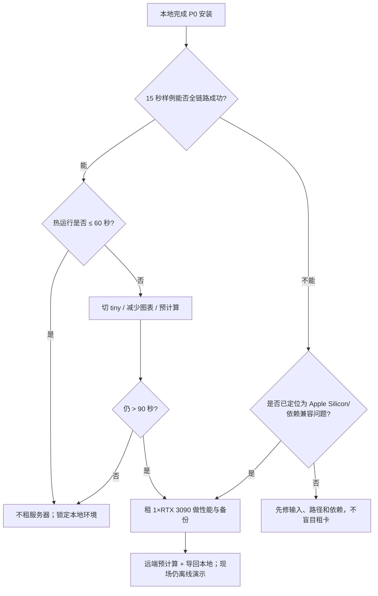

# 04｜环境安装、服务器与成本手册

> 项目：**听清又听懂·智能音频急救台（AudioRescue）**
> 适用时间：2026-07-14 至 2026-07-16 两天 Vibe Coding 黑客松
> 主链路：DeepFilterNet → Whisper 前后转写 → Gradio A/B 展示
> 可选模块：CLAP 环境事件标签（只在 P0 稳定后安装）
> 本手册目标：让团队在最短时间内得到一个**本地可运行、现场可离线、失败可降级**的演示系统。

---

## 0. 先看结论：本项目默认不租服务器

### 0.1 当前机器能不能做

当前主机是 MacBook Air：

- Apple M4，10 核 CPU、8 核 GPU；
- 16 GB 统一内存；
- 当前仅约 12 GB 可用磁盘空间（2026-07-14 实测，后续以再次检查为准）。

对于本项目的 P0——10～30 秒短音频、DeepFilterNet 推理、Whisper `tiny`/`base` 前后各转写一次、Gradio 展示——**原则上可以在本机完成**。因为我们不训练模型，也不要求真正流式实时处理；模型可以串行加载和运行，避免同时占满内存。

当前真正的第一风险不是算力，而是磁盘空间。安装 Python 环境、PyTorch、音频依赖、模型权重、缓存和若干演示结果后，约 12 GB 余量很容易触底。

### 0.2 今晚必须做的资源动作

1. **额外腾出 15～25 GB**，使最终可用空间达到约 27～37 GB；
2. 只做安全检查和人工确认，不允许脚本擅自删除用户文件；
3. 先安装 P0 依赖，不安装 CLAP；
4. 用 10～15 秒固定样例完成一次完整冷启动和一次热启动；
5. 若本地稳定，就不租 GPU；若遇到明确性能或兼容性阻塞，再租 1 张 RTX 3090。

### 0.3 服务器定位

服务器不是产品架构中的必需节点，只承担以下一种或多种临时任务：

- 验证 Linux/NVIDIA 环境能否稳定跑通；
- 批量预计算三个演示样例；
- 当本机转写过慢时做性能对照；
- 作为代码和结果备份环境；
- 为 P1 的 CLAP 提供额外显存。

**现场主演示必须能在本地、断网状态下启动。** 不把公网、远程 GPU、SSH 隧道或临时域名放进主演示链路。

---

## 1. 两天内的环境策略

### 1.1 唯一推荐组合

| 项目 | 锁定选择 | 原因 |
|---|---|---|
| 操作系统 | 当前 macOS；服务器为 Ubuntu 22.04 | 不更换本地主机；Linux 远端生态稳定 |
| Python | 3.10 | 同时兼顾 Whisper 官方支持范围和音频包兼容性 |
| UI | Gradio | 一份 Python 代码即可完成上传、录音、音频播放和图表 |
| 增强 | `deepfilternet` | 官方提供预训练推理和命令行/Python 接口 |
| 转写 | `openai-whisper`，中文多语言 `tiny` 或 `base` | 官方实现，避免比赛中频繁更换后端 |
| 音频工具 | ffmpeg + soundfile + scipy/librosa | 覆盖转码、读写、重采样和分析 |
| 可视化 | matplotlib（P0 锁定） | 直接生成本地 PNG、离线稳定；不维护两套图形逻辑 |
| 测试 | pytest | 快速覆盖输入校验和结果契约 |
| P1 | CLAP 单独安装、单独开关 | 防止可选模块破坏 P0 环境 |

### 1.2 版本策略：先兼容，跑通后立刻冻结

两天比赛中，版本管理的目标不是追新，而是复现：

1. 固定 Python 3.10；
2. 第一轮只安装各项目官方安装方式与少量通用依赖；
3. 第一条样例全链路成功后，立即执行 `pip freeze`；
4. 保存为 `requirements-lock.txt`；
5. 除非出现阻断性错误，不再全量升级；
6. 新增 P1 依赖前先提交代码并备份锁文件；
7. CLAP 若引发 PyTorch、NumPy 或 Transformers 冲突，直接回退，不牺牲 P0。

不要在比赛最后半天执行以下操作：

- `pip install -U` 全量升级；
- 更换 Python 大版本；
- 更换 Gradio 主版本；
- 重新安装 PyTorch；
- 清空全部模型缓存；
- 为追求几秒速度切换另一套 Whisper 实现。

---

## 2. 本地磁盘准备：只检查，不自动删除

### 2.1 查看当前余量

```bash
df -h /
```

目标：开始安装前，最好看到至少 28 GB 可用；最低也应确保有 20 GB 以上，并且不再下载大型无关文件。

### 2.2 安全地找出大文件

以下命令只读取信息，不删除任何内容：

```bash
du -sh ~/Downloads/* 2>/dev/null | sort -h | tail -30
find ~/Downloads -type f -size +500M -print 2>/dev/null
du -sh ~/Library/Caches 2>/dev/null
du -sh ~/.cache 2>/dev/null
```

人工检查优先级：

1. `Downloads` 中已经用完的安装包、压缩包、重复视频；
2. 已经确认可重新下载的大型缓存；
3. 旧虚拟环境、旧模型副本；
4. 废纸篓中已确认不需要的内容。

### 2.3 禁止直接做的事情

- 不运行未经检查的“Mac 一键清理”脚本；
- 不删除整个 `~/Library` 或整个 `~/Library/Caches`；
- 不删除微信、浏览器、IDE 等应用数据目录；
- 不在不清楚内容时执行递归删除；
- 不让 Coding Agent 自行决定哪些用户文件“应该没用”。

如果需要删除，先让命令列出**绝对路径、大小和类型**，由人确认后再手工处理。腾出的空间还要通过 `df -h /` 复核，因为未清空废纸篓时空间可能没有真正释放。

---

## 3. 本地目录和缓存规划

### 3.1 建议目录

```text
audio-rescue/
├─ .venv/                    # 本机 Python 环境，不入 Git
├─ models/
│  └─ whisper/               # Whisper 权重，明确指定下载目录
├─ .cache/                   # 可选统一缓存，不入 Git
├─ demo_assets/
│  ├─ inputs/                # 三个锁定演示样例
│  ├─ references/            # 已知台词，仅用于 CER 样例
│  └─ precomputed/           # 现场降级结果
├─ outputs/                  # 每次处理结果，不入 Git
├─ logs/                     # 运行日志，不入 Git
├─ app.py
├─ requirements.in
└─ requirements-lock.txt
```

### 3.2 缓存原则

- Whisper 在代码中明确传入 `download_root="./models/whisper"`；
- 若包支持环境变量，可将通用缓存收拢到项目目录；
- 不要同时保留同一模型的多个重复副本；
- 模型下载成功后记录文件大小、修改时间和校验值；
- 最终演示机只保留 `tiny` 或 `base` 中实际采用的一个主模型，另一个只有在空间充足时保留；
- CLAP 权重单独放置，P1 被砍时可以独立移走；
- `.venv`、模型、缓存、输入隐私音频和大结果都不提交 Git。

可选环境变量示例：

```bash
export XDG_CACHE_HOME="$PWD/.cache"
export TORCH_HOME="$PWD/.cache/torch"
export HF_HOME="$PWD/.cache/huggingface"
```

这些环境变量应写入项目自己的启动脚本或 `.env.example`，不要修改整台电脑的全局设置。若已有模型下载到了默认缓存，不要在比赛期间盲目搬移；先确认应用确实能读取新路径。

### 3.3 演示资产纪律

每个样例保留：

- 原始输入；
- 预期的增强输出；
- 原始/增强转写；
- 波形和声谱图；
- 处理结果 JSON；
- 可选参考台词；
- 运行环境说明。

三个样例尽量控制在 10～20 秒，避免音频过长造成等待和不可控转写。所有现场样例在 7 月 15 日晚前锁定，不在答辩前临时换素材。

---

## 4. 本地安装步骤（macOS / Apple Silicon）

### 4.0 本机实测状态（2026-07-14）

本次检查得到：

```text
默认 python3：Python 3.13.12
默认路径：用户本机 Miniforge 的 `bin/python3`
Homebrew Python 3.10：/opt/homebrew/opt/python@3.10
FFmpeg：尚未安装
```

因此不要在当前 Miniforge Python 3.13 环境中安装项目包。Whisper 官方仓库给出的预期兼容范围是 Python 3.8～3.11，本项目锁定已存在的 Homebrew Python 3.10。FFmpeg 是今晚需要补装的系统依赖。

### 4.1 安装前检查

```bash
uname -m
python3 --version
which python3
ffmpeg -version
```

预期架构为 `arm64`。若当前 Python 不是 3.10，不要用系统 Python 硬装包；先准备独立的 Python 3.10。

### 4.2 准备 ffmpeg 和 Python 3.10

本机已经有 Homebrew Python 3.10，只需先安装当前缺失的 FFmpeg：

```bash
brew install ffmpeg
```

若换到另一台演示机且没有 Python 3.10，再执行 `brew install python@3.10`。安装后确认：

```bash
ffmpeg -version
/opt/homebrew/opt/python@3.10/bin/python3.10 --version
```

注意：Whisper 官方仓库明确要求系统可用 ffmpeg；缺少 ffmpeg 时，MP3/M4A 等输入可能无法读取。

### 4.3 创建独立环境

在仓库根目录执行：

```bash
/opt/homebrew/opt/python@3.10/bin/python3.10 -m venv .venv
source .venv/bin/activate
python -m pip install --upgrade pip setuptools wheel
python --version
```

预期 `python --version` 为 3.10.x，`which python` 指向当前项目的 `.venv/bin/python`。

### 4.4 先装 P0，不装 CLAP

建议分两批安装，便于定位错误：

```bash
python -m pip install deepfilternet
python -m pip install -U openai-whisper
python -m pip install gradio soundfile scipy librosa matplotlib jiwer pydantic pytest
```

如果 Whisper 安装过程中需要 Rust 或 `tiktoken` 构建工具，按错误信息补齐构建依赖，不要顺手升级全部包。若 `deepfilternet` 在 Apple Silicon 上需要本地编译，也先保存完整报错，再决定补编译工具还是启用远端降级。

### 4.5 立刻记录安装状态

```bash
python -V
python -m pip check
python -m pip freeze > requirements-lock.txt
ffmpeg -version > logs/ffmpeg-version.txt
python -m pip freeze > logs/pip-freeze.txt
```

如果 `logs/` 尚未存在，先创建它。锁文件只有在一次完整样例运行成功后才视为正式版本；之后每次必要变更都要注明原因。

---

## 5. 最小运行验证

### 5.1 ffmpeg 转码验证

项目统一采用以下数据路径：

1. 用户输入可以是 WAV/MP3/M4A；
2. 用 ffmpeg 转成 48 kHz、单声道、PCM WAV 供 DeepFilterNet；
3. 增强结果保存为 48 kHz WAV；
4. Whisper 使用同一音频文件，由其解码/重采样路径处理；
5. 不覆盖用户原始文件。

示例命令：

```bash
ffmpeg -y -i demo_assets/inputs/sample.wav -ac 1 -ar 48000 -c:a pcm_s16le outputs/sample_48k_mono.wav
ffprobe -v error -show_entries stream=sample_rate,channels,duration -of default=noprint_wrappers=1 outputs/sample_48k_mono.wav
```

### 5.2 DeepFilterNet 命令行验证

DeepFilterNet 官方提供 `deepFilter` 命令。首次运行可能下载或初始化默认模型：

```bash
deepFilter outputs/sample_48k_mono.wav
```

检查点：

- 进程正常退出；
- 输出文件存在且大小非零；
- 音频能播放、时长与输入大致一致；
- 没有削波、空白或声道异常；
- 记录第一次运行和第二次运行耗时；
- 记录实际生成路径，不在代码中猜文件名。

注意：DeepFilterNet 官方预编译命令行针对 48 kHz WAV，P0 应固定转换为该格式，避免现场输入格式分支过多。

### 5.3 Whisper 中文转写验证

命令行快速验证：

```bash
whisper demo_assets/inputs/sample.wav --model tiny --language Chinese --task transcribe --fp16 False --output_dir outputs/whisper_tiny
```

确认 `tiny` 跑通后再测试 `base`：

```bash
whisper demo_assets/inputs/sample.wav --model base --language Chinese --task transcribe --fp16 False --output_dir outputs/whisper_base
```

选型标准：

- 只选多语言 `tiny` 或 `base`，不要选 `.en` 模型处理中文；
- 对三个锁定样例比较可读性、错误类型和耗时；
- 若 `base` 的单轨转写时间可接受，优先 `base`；
- 若前后两轨合计等待明显影响演示，锁定 `tiny`；
- 不以参数规模决定，用三条样例的实际结果决定；
- CPU 模式显式使用 `fp16=False`。

### 5.4 Python 导入验证

```bash
python - <<'PY'
import torch
import gradio
import whisper
from df.enhance import enhance, init_df
print("torch:", torch.__version__)
print("mps available:", torch.backends.mps.is_available())
print("imports: OK")
PY
```

### 5.5 全链路验收

每次环境修改后，至少完成：

```text
输入读取
  → 转为 48 kHz 单声道
  → DeepFilterNet 增强
  → 原始音频 Whisper 转写
  → 增强音频 Whisper 转写
  → 波形/声谱图生成
  → ProcessResult 返回
  → Gradio 页面播放与展示
```

每个步骤必须把异常转成可读警告；可选模块失败时不得让整个页面崩溃。

---

## 6. Apple Silicon 的 CPU / MPS 选择

### 6.1 默认结论

**锁定演示默认使用 CPU。** M4 CPU 对 10～20 秒短样例的 `tiny`/`base` 推理有机会达到可接受速度，而 CPU 路径通常更容易复现。DeepFilterNet 和 Whisper 串行执行，不同时常驻全部可选模型。

### 6.2 为什么不直接承诺 MPS

MPS 是否可用不仅取决于 `torch.backends.mps.is_available()`，还取决于具体模型算子和当前包版本。某些路径可能回落 CPU、出现精度差异或遇到不支持算子。两天比赛中，MPS 是性能实验，不是默认架构。

### 6.3 MPS 测试门槛

只有同时满足以下条件，才允许把某模块切到 MPS：

1. 三个演示样例连续运行 5 轮无报错；
2. 输出与 CPU 版本在听感、长度、文本上无明显退化；
3. 端到端耗时至少降低 20%；
4. 内存峰值没有导致系统换页或界面卡顿；
5. 断网冷启动仍成功；
6. 有一键切回 CPU 的配置项。

可测试：

```bash
export PYTORCH_ENABLE_MPS_FALLBACK=1
```

但该变量可能掩盖“部分算子其实在 CPU 上运行”的事实，因此必须记录真实端到端耗时，不能仅凭设备名宣称 GPU 加速。

### 6.4 内存控制

- DeepFilterNet 处理完成后释放不再使用的中间数组；
- 原始与增强音频可并行展示，但模型推理串行；
- Whisper 模型只加载一次，先跑原始轨再跑增强轨；
- CLAP 只在用户勾选时加载，或单独进程运行；
- 输入默认限制 60 秒，主演示控制 10～20 秒；
- 声谱图显示降采样后的数据，不画全部高分辨率点；
- 发现系统明显换页时，先关闭 CLAP和无关应用，不急着升级模型。

---

## 7. 本地性能门槛与租服务器决策树

### 7.1 基准样例

使用同一个 15 秒中文噪声音频，记录：

- 应用冷启动时间；
- 模型已加载后的热启动时间；
- DeepFilterNet 耗时；
- Whisper 原始轨耗时；
- Whisper 增强轨耗时；
- 图表生成耗时；
- 总耗时；
- 内存峰值；
- 是否出现错误或音频异常。

### 7.2 判断阈值

| 15 秒样例端到端热耗时 | 结论 | 动作 |
|---:|---|---|
| ≤ 30 秒 | 理想 | 保持本地，不租服务器 |
| 30～60 秒 | 可接受 | 页面显示进度；继续本地；准备预计算样例 |
| 60～90 秒 | 勉强 | 尝试 `tiny`、减少图表开销；服务器只做备份 |
| > 90 秒 | 不适合现场等待 | 若 1 小时内无法优化，租 RTX 3090 做验证/预计算 |
| 崩溃、无法安装、反复内存不足 | 兼容性阻塞 | 保留完整日志；启动 Linux/NVIDIA 降级方案 |

### 7.3 决策树



### 7.4 明确不租的情况

- 只是因为“比赛项目好像应该有 GPU”；
- 本地已经能在 60 秒内稳定完成；
- 只是为了跑一个 15 秒样例；
- 服务器配置、支付或网络会占用超过 1 小时；
- 现场必须依赖远端接口才能点击演示；
- 团队尚未完成本地输入校验、UI 和错误处理；
- P0 还没跑通，却想先上 CLAP 或大模型。

### 7.5 应该租的情况

- Apple Silicon 上 DeepFilterNet 依赖明确无法在合理时间内解决；
- `tiny` 仍超过现场可接受等待时间；
- 需要批量预计算大量测试样例；
- CLAP 被确认是重要加分项，但本地内存确实不足；
- 需要一个干净 Linux 环境验证复现性；
- 本地机器出现硬件/磁盘故障，需要紧急备用。

---

## 8. 推荐服务器型号与配置

### 8.1 首选：AutoDL RTX 3090

适合中国大陆团队，优先考虑访问、支付和传输便利。

推荐最低配置：

| 项目 | 推荐 |
|---|---|
| GPU | 1× RTX 3090，24 GB 显存 |
| CPU | 8 vCPU 或以上 |
| 内存 | 32 GB 或以上 |
| 系统盘 | 50～80 GB |
| 数据盘 | 50 GB，只有确定需要时创建 |
| 系统 | Ubuntu 22.04 |
| Python | 3.10 |
| CUDA/PyTorch | 3090/4090 选择 CUDA 11.1+ 且平台已验证匹配的 PyTorch 镜像，不临时手工重装 |
| 租用方式 | 按量计费，预计活跃 6～12 小时 |

为什么 3090 足够：本项目是短音频推理，不训练模型；Whisper `tiny`/`base` 和 DeepFilterNet 对 24 GB 显存都很宽裕。A100/H100 不会显著改善项目完成度，反而增加成本和选型时间。

### 8.2 次选：AutoDL RTX 4090

配置同上，GPU 改为 1× RTX 4090 24 GB。适用于：

- 3090 无库存；
- 需要更快批量预计算；
- 租用时间很短，节省开发时间比每小时差价更重要。

4090 不是功能必需项。不要为了“更高级”选择 5090、L20、A100 或 H100。

### 8.3 海外备选：RunPod

若团队已有国际支付和稳定网络，可选：

1. L4 24 GB：功耗低，推理够用；
2. RTX 3090 24 GB：性价比合适；
3. RTX 4090 24 GB：追求更快迭代。

RunPod 只作为海外备选。若网络、镜像下载或付款会造成额外不确定性，就选择 AutoDL 或继续本地。

### 8.4 不推荐型号

- 8～12 GB 显存的旧卡：省下的钱不值得兼容和 OOM 风险；
- T4 16 GB：可以跑小模型，但没有必要为较慢的旧架构增加等待；
- A100/H100：本项目没有训练任务，明显过度配置；
- 多卡实例：代码没有多卡并行需求；
- 超大 CPU/内存实例：音频样例短，32 GB 内存已经足够。

---

## 9. 价格快照与预算

> 以下为 **2026-07-14 官方页面快照**，库存、地区、主机、计费方式和实时活动会改变价格；下单时必须以平台页面为准。估算仅含 GPU 实例小时费，不含数据盘、文件存储、快照、流量、税费或闲置保留成本。

### 9.1 AutoDL 当前页面价格

| GPU | 页面价格 | 6 小时估算 | 12 小时估算 | 24 小时估算 |
|---|---:|---:|---:|---:|
| RTX 3090 24 GB | ¥1.32/小时 | ¥7.92 | ¥15.84 | ¥31.68 |
| RTX 4090 24 GB | ¥1.98/小时 | ¥11.88 | ¥23.76 | ¥47.52 |

预算建议：

- 3090：充值约 ¥30，目标活跃 6～12 小时；
- 4090：充值约 ¥40，目标活跃 6～12 小时；
- 任务完成立即关机并检查数据盘/存储是否仍计费；
- 不要为了省几元让三个人浪费一小时，但也不要忘记关闭整夜空闲实例。

AutoDL 官方价格说明提醒：关机后某些数据盘仍可能计费；不再使用时应按平台规则释放或缩容。平台文件存储也有独立计费规则。

### 9.2 RunPod 当前页面价格

| GPU | 页面价格 | 6 小时估算 | 12 小时估算 | 24 小时估算 |
|---|---:|---:|---:|---:|
| L4 24 GB | $0.39/小时 | $2.34 | $4.68 | $9.36 |
| RTX 3090 24 GB | $0.46/小时 | $2.76 | $5.52 | $11.04 |
| RTX 4090 24 GB | $0.69/小时 | $4.14 | $8.28 | $16.56 |

海外平台还要考虑镜像拉取、数据存储、网络和支付摩擦；不能只比较标价。

---

## 10. 远端实例初始化手册

### 10.1 创建实例前的清单

- 选择 1 张 3090/4090，不选多卡；
- 选择 Ubuntu 22.04；
- 优先选择已经预装 PyTorch 且 CUDA 可用的镜像；
- CPU 至少 8 vCPU、内存至少 32 GB；
- 系统盘 50～80 GB；
- 数据盘按需创建 50 GB，不要默认开几百 GB；
- 保存实例地区、价格、SSH 地址、关机和释放规则；
- 只上传公开或经授权的演示音频。

### 10.2 登录后的五项检查

```bash
nvidia-smi
python --version
python -c "import torch; print(torch.__version__); print(torch.cuda.is_available()); print(torch.version.cuda)"
ffmpeg -version
df -h
```

预期：

- `nvidia-smi` 能看到一张正确型号 GPU；
- Python 最好是 3.10；
- `torch.cuda.is_available()` 为 `True`；
- ffmpeg 可用；
- 磁盘空间符合购买配置。

如果平台镜像已经提供可用 PyTorch/CUDA，**不要先卸载重装**。先复用平台匹配好的版本，再安装项目层依赖。

### 10.3 系统依赖

根据镜像权限执行：

```bash
apt-get update
apt-get install -y ffmpeg git libsndfile1
```

若没有 root 权限，使用平台提供的包管理方式或联系镜像说明，不要在半夜编译一整套 ffmpeg。

### 10.4 Python 环境

若镜像 Python 已是 3.10 且 PyTorch/CUDA 正常：

```bash
python -m venv --system-site-packages .venv
source .venv/bin/activate
python -m pip install --upgrade pip setuptools wheel
```

然后安装项目依赖：

```bash
python -m pip install deepfilternet
python -m pip install -U openai-whisper
python -m pip install gradio soundfile scipy librosa matplotlib jiwer pydantic pytest
python -m pip check
```

若平台基础 Python 不是 3.10，可创建独立 Conda 3.10 环境，但必须按平台镜像说明安装与 CUDA 匹配的 PyTorch。不要在本手册中硬编码一个可能不匹配平台驱动的 CUDA wheel 地址。

### 10.5 GPU 验证

```bash
python - <<'PY'
import torch
print("CUDA available:", torch.cuda.is_available())
if torch.cuda.is_available():
    print("GPU:", torch.cuda.get_device_name(0))
    print("VRAM GB:", round(torch.cuda.get_device_properties(0).total_memory / 1024**3, 1))
PY
```

随后只用一个 10～15 秒样例跑完整链路。先成功，再批量。

### 10.6 固定环境

```bash
python -m pip freeze > requirements-server-lock.txt
nvidia-smi > logs/nvidia-smi.txt
python -c "import torch; print(torch.__version__, torch.version.cuda)" > logs/torch-cuda.txt
```

本地和服务器的锁文件分开保存。不要假设 macOS 与 Linux 的完整 `pip freeze` 可以互相直接覆盖。

---

## 11. 代码与数据同步

### 11.1 推荐同步原则

- 代码优先通过团队 Git 仓库同步；
- 模型权重由服务器自行下载，不从本机上传；
- 输入只传三个非敏感演示样例；
- `.venv`、缓存和大输出不进 Git；
- 从服务器拉回的是预计算结果、性能日志和必要锁文件；
- 不在同一文件上同时远端和本地修改。

### 11.2 无远程 Git 时的 rsync 示例

上传代码：

```bash
rsync -av \
  --exclude '.venv' \
  --exclude '.cache' \
  --exclude 'models' \
  --exclude 'outputs' \
  ./ USER@HOST:/workspace/audio-rescue/
```

拉回结果：

```bash
rsync -av USER@HOST:/workspace/audio-rescue/demo_assets/precomputed/ ./demo_assets/precomputed/
rsync -av USER@HOST:/workspace/audio-rescue/logs/ ./logs/server/
```

实际执行前替换 `USER`、`HOST` 和远端路径。先用少量文件验证方向，避免把空目录覆盖到有内容的目录。

---

## 12. 远端安全与网络

### 12.1 SSH 与密钥

- 优先使用 SSH 密钥，不在群聊中发送密码；
- 平台密钥、Token 和临时密码不提交 Git；
- `.env` 加入 `.gitignore`；
- 三个人只共享必要凭据，项目结束后撤销或销毁；
- 实例公网地址和端口不写进答辩 PPT。

### 12.2 Gradio 访问

远端调试时，Gradio 绑定到本机回环地址：

```text
127.0.0.1:7860
```

通过 SSH 隧道访问：

```bash
ssh -L 7860:127.0.0.1:7860 USER@HOST
```

浏览器打开 `http://127.0.0.1:7860`。不要为了方便把 Gradio 无鉴权暴露到 `0.0.0.0` 公网；更不要上传真实会议或采访隐私录音到开放服务。

### 12.3 音频隐私

- 演示优先使用团队自己录制、公开授权或合成的短音频；
- 私人会议、课堂、采访录音未经许可不得上云；
- 远端输出不再需要时删除，并在释放实例前复核；
- 日志不要打印音频的个人身份信息或完整私有路径。

---

## 13. 服务器关停与释放 SOP

每次结束远端工作前执行：

1. 将 `demo_assets/precomputed/` 拉回本地；
2. 将 `logs/`、锁文件和基准数据拉回本地；
3. 本地打开至少一条增强音频并核对时长；
4. 确认代码已提交或同步；
5. 删除远端敏感输入；
6. 停止 Gradio 和所有后台任务；
7. 在平台控制台关机；
8. 检查关机后系统盘、数据盘、文件存储、快照是否继续计费；
9. 若不再需要恢复环境，按平台规则释放实例和不必要数据盘；
10. 在团队群中记录“已关停/已释放”和时间。

不要只关闭 SSH 窗口。SSH 断开不等于 GPU 实例停止计费。

---

## 14. P1：CLAP 的隔离安装策略

### 14.1 进入条件

只有以下全部完成后才允许安装 CLAP：

- DeepFilterNet + Whisper + Gradio P0 已锁定；
- 三个样例可离线运行；
- `requirements-lock.txt` 已保存；
- 代码已提交；
- 主演示路径已有预计算降级结果；
- 团队还剩至少 4 小时有效开发时间。

### 14.2 安装方式

优先在新分支或独立虚拟环境中试装，避免污染主演示环境。CLAP 包及其 PyTorch/Transformers 依赖容易与现有栈产生版本联动；一旦出现需要大范围降级/升级，立即停止。

验收标准：

- 只识别固定的 8～12 个候选标签；
- 读原始轨，而不是强降噪后的轨；
- 关闭 CLAP 时 P0 行为完全不变；
- 模型加载失败时页面只提示“环境事件模块不可用”；
- 本机内存不足时可由服务器预计算标签；
- 答辩现场断网仍有缓存或直接关闭该模块。

### 14.3 回退规则

出现以下任一情况，删除 CLAP 在主演示中的入口：

- 标签明显乱跳，无法解释；
- 安装引发 P0 依赖冲突；
- 启动时间增加超过可接受范围；
- 16 GB 内存导致系统卡顿；
- 必须联网下载权重；
- 结果对项目故事没有明显加分。

---

## 15. 现场离线预案

### 15.1 演示机锁定

7 月 15 日晚选定唯一主演示机。选择标准依次为：

1. P0 连续运行稳定；
2. 可完全断网启动；
3. 音频播放和投屏正常；
4. 风扇、发热和电量可控；
5. 启动步骤最少；
6. 性能足够，而不是跑分最高。

### 15.2 必须离线缓存的内容

- Python 环境；
- 最终 DeepFilterNet 模型；
- 最终 Whisper `tiny` 或 `base` 权重；
- Gradio 前端资源；
- 三个输入样例；
- 三套预计算输出；
- 页面截图；
- 一段完整成功演示录像；
- `requirements-lock.txt`；
- 启动说明和故障切换说明。

### 15.3 断网演练

关闭 Wi-Fi 后：

1. 重启应用；
2. 载入第一个固定样例；
3. 完成增强；
4. 完成前后转写；
5. 播放两条音频；
6. 展示波形/声谱图；
7. 导出结果；
8. 再换一个样例重复；
9. 记录端到端耗时；
10. 确认没有任何在线字体、CDN 或模型下载请求阻塞页面。

连续通过 3 次才算现场就绪。

### 15.4 四级降级

| 级别 | 条件 | 演示方式 |
|---|---|---|
| L0 正常 | 现场计算成功 | 现场上传并完成录制后处理 |
| L1 慢 | 推理可运行但等待过长 | 用 10 秒样例，显示进度；第二条用预计算 |
| L2 模型失败 | UI 可启动但推理报错 | 切换到预计算结果，解释离线容错设计 |
| L3 主机/投屏失败 | 应用无法展示 | 播放本地录屏 + 静态截图 + A/B 音频 |

预计算结果不是造假：必须来自同一版本代码、同一模型和同一输入，并在页面上明确标注“预计算演示样例”。

### 15.5 比赛当天禁区

- 不更新模型；
- 不重新创建环境；
- 不切换 Whisper 后端；
- 不为一个小 UI 动画改动核心处理代码；
- 不依赖服务器公网；
- 不临时加入陌生音频格式；
- 不清空缓存；
- 不把未经演练的“实时麦克风流”设为主演示。

---

## 16. 故障定位速查

### 16.1 `ffmpeg not found`

检查：

```bash
which ffmpeg
ffmpeg -version
echo "$PATH"
```

处理：重新打开终端或把 Homebrew 的 bin 路径加入当前 shell；不要在 Python 代码里写死某台机器的绝对路径。

### 16.2 Whisper 下载卡住

- 检查磁盘余量；
- 检查 `models/whisper/` 是否出现不完整文件；
- 在网络稳定时完成一次下载；
- 记录最终权重路径；
- 断网启动验证；
- 不要答辩当天才首次加载模型。

### 16.3 DeepFilterNet 输入失败

优先把输入统一转为：

```text
48 kHz / mono / PCM 16-bit WAV
```

然后检查音频时长、是否全零、是否损坏、输出目录权限。不要先更换增强模型。

### 16.4 Apple Silicon 安装失败

保留以下信息：

```bash
uname -m
python -V
python -m pip -V
python -m pip check
python -m pip freeze
```

判断是包无 arm64 wheel、编译工具缺失、Python 版本不符，还是磁盘不足。只有确认属于平台兼容问题且 1 小时内无法解决，才启用 RTX 3090 远端方案。

### 16.5 CUDA 不可用

```bash
nvidia-smi
python -c "import torch; print(torch.cuda.is_available(), torch.__version__, torch.version.cuda)"
```

若平台镜像中二者不匹配，优先换成平台官方推荐的 PyTorch 镜像，而不是手工反复组合驱动、CUDA Toolkit 和 PyTorch wheel。

### 16.6 Gradio 页面能开但处理崩溃

- 将错误记录到 `warnings`，保持页面存活；
- 单独运行后端函数排除 UI；
- 用固定 WAV 排除浏览器录音格式；
- 检查临时文件是否已经被删除；
- 检查两个并发请求是否争抢同一输出路径；
- 为每次任务生成独立 ID 和输出目录；
- 必要时限制并发为 1。

### 16.7 磁盘再次不足

先停止新下载，检查：

```bash
df -h /
du -sh .venv models .cache outputs logs 2>/dev/null
```

人工决定是否清除：失败下载、重复输出或非最终模型。不要自动删除最后一份权重、锁文件和演示资产。

---

## 17. 环境验收表

### 17.1 7 月 14 日晚

- [ ] 可用磁盘达到目标余量；
- [ ] Python 3.10 虚拟环境创建成功；
- [ ] ffmpeg 可用；
- [ ] DeepFilterNet 导入和命令行成功；
- [ ] Whisper `tiny` 中文转写成功；
- [ ] Gradio 页面能启动；
- [ ] 至少一条 10～15 秒样例完成全链路；
- [ ] 记录冷/热运行耗时；
- [ ] `requirements-lock.txt` 已生成；
- [ ] 明确是否需要租服务器。

### 17.2 7 月 15 日中午

- [ ] 三个样例均成功；
- [ ] `tiny`/`base` 已二选一；
- [ ] CPU/MPS 已锁定，不再实验；
- [ ] 服务器若启用，预计算结果已拉回；
- [ ] 现场主演示机已确定；
- [ ] 本地断网至少运行一次；
- [ ] P1 是否进入已有明确决定。

### 17.3 7 月 15 日晚

- [ ] 断网连续 3 次通过；
- [ ] 三套预计算结果完整；
- [ ] 完整演示录像已保存；
- [ ] 模型和依赖不再升级；
- [ ] 所有服务器已关停或明确保留原因；
- [ ] 存储计费状态已检查；
- [ ] 启动步骤控制在 3 条命令以内。

### 17.4 7 月 16 日答辩前

- [ ] 电脑接电；
- [ ] 关闭自动更新和无关高耗应用；
- [ ] 音量、投屏、浏览器缩放已测试；
- [ ] 本地服务已预热；
- [ ] 第一条样例已经缓存；
- [ ] 录屏和静态结果可一键打开；
- [ ] 不再进行环境变更。

---

## 18. 最终采购建议

### 默认方案：¥0 云算力

先在 M4 MacBook Air 上：

1. 额外腾出 15～25 GB；
2. Python 3.10 + ffmpeg；
3. DeepFilterNet + Whisper `tiny`；
4. 15 秒样例端到端基准；
5. 若速度允许，再比较 `base`；
6. 锁定 CPU 稳定路径；
7. 保存预计算结果并断网演练。

### 触发式备选：¥30 左右预算

如果本地出现明确阻塞，租 AutoDL：

```text
1× RTX 3090 24 GB
8+ vCPU
32+ GB RAM
Ubuntu 22.04
50～80 GB 系统盘
按需 50 GB 数据盘
预计活跃 6～12 小时
```

3090 无库存或需要更快批量处理时，改为 RTX 4090 24 GB。服务器完成验证和预计算后，立即把资产拉回本地并关停；不让服务器成为答辩现场的单点故障。

---

## 19. 官方参考资料

- [DeepFilterNet 官方仓库](https://github.com/Rikorose/DeepFilterNet)：macOS/Linux/Windows 支持、`pip install deepfilternet`、`deepFilter` 命令和 48 kHz WAV 说明。
- [OpenAI Whisper 官方仓库](https://github.com/openai/whisper)：安装方式、ffmpeg 要求、Python 支持范围、模型规格和中文多语言模型使用方式。
- [AutoDL 当前 GPU 页面](https://www.autodl.com/home)：GPU 型号、库存和即时页面价格。
- [AutoDL GPU 使用说明](https://www.autodl.com/docs/gpu/)：3090/4090 等卡的 CUDA 要求与 CPU/内存分配说明。
- [AutoDL 计费说明](https://www.autodl.com/docs/price/)：实例、数据盘和文件存储计费注意事项。
- [RunPod GPU Cloud Pricing](https://www.runpod.io/pricing)：Pod GPU、显存、CPU、内存和每小时价格。

> 所有价格均须在下单时重新核对。两天比赛的正确顺序始终是：**先让本地 P0 成功，再用服务器解决已经被证实的问题。**
